# Talos-Tofu Infrastructure C4 Diagrams

This document contains C4 architecture diagrams for the Talos-Tofu project, which automates the deployment of a Talos Kubernetes cluster on Proxmox VE using Terraform/OpenTofu.

## Level 1: System Context Diagram

```mermaid
graph TB
    Admin["👨‍💻 Admin"]
    Dev["👩‍💻 Developer"]
    TalosCluster["⚡ Talos Cluster"]
    Proxmox["🖥️ Proxmox"]
    DNS["🌐 DNS"]
    Cloudflare["🔶 Cloudflare"]
    Git["📚 Git"]
    
    Admin -.->|"Manages"| TalosCluster
    Dev -.->|"Deploys"| Git
    TalosCluster -->|"Syncs"| Git
    TalosCluster -->|"Runs on"| Proxmox
    TalosCluster -->|"Updates"| DNS
    TalosCluster -->|"Validates"| Cloudflare
```

## Level 2: Container Diagram

```mermaid
graph TB
    Admin["👨‍💻 Admin"]
    Terraform["🚀 Terraform"]
    ControlPlanes["🎛️ Control Planes"]
    WorkerNodes["🖥️ Workers"]
    ArgoCD["🔄 ArgoCD"]
    Ingress["🌍 Ingress"]
    CertManager["🔐 Cert-Manager"]
    MetalLB["⚖️ MetalLB"]
    ExternalDNS["🌍 External DNS"]
    Proxmox["🖥️ Proxmox"]
    DNS["🌐 DNS"]
    Cloudflare["🔶 Cloudflare"]
    Git["📚 Git"]
    
    Admin -.->|"Deploy"| Terraform
    Terraform -->|"Create"| Proxmox
    Terraform -->|"Update"| DNS
    Terraform -->|"Configure"| ControlPlanes
    Terraform -->|"Configure"| WorkerNodes
    
    ControlPlanes -->|"Manage"| WorkerNodes
    ArgoCD -->|"Sync"| Git
    CertManager -->|"Validate"| Cloudflare
    ExternalDNS -->|"Update"| DNS
    Ingress -->|"Use"| MetalLB
```

## Level 3: Component Diagram

```mermaid
graph TB
    MainTF["📄 main.tf"]
    VarsTF["📝 variables.tf"]
    OutputsTF["📤 outputs.tf"]
    ControlPlaneTF["🎛️ control-plane.tf"]
    WorkerTF["🖥️ worker.tf"]
    DependenciesTF["🔗 dependencies.tf"]
    DNSTF["🌍 dns.tf"]
    ClusterTF["🎯 cluster.tf"]
    AppsTF["📦 apps.tf"]
    Helmfile["📋 helmfile.yaml"]
    ArgoCDManifests["🔄 ArgoCD"]
    IngressManifests["🌍 Ingress"]
    ProxmoxAPI["🖥️ Proxmox API"]
    DNSAPI["🌍 DNS API"]
    K8sAPI["⚙️ K8s API"]
    
    MainTF -->|"Calls"| ControlPlaneTF
    MainTF -->|"Calls"| DNSTF
    MainTF -->|"Calls"| ClusterTF
    
    ControlPlaneTF -->|"Creates"| ProxmoxAPI
    WorkerTF -->|"Creates"| ProxmoxAPI
    DNSTF -->|"Updates"| DNSAPI
    ClusterTF -->|"Bootstraps"| K8sAPI
    AppsTF -->|"Deploys"| K8sAPI
    
    ClusterTF -.->|"Uses"| Helmfile
    AppsTF -.->|"Deploys"| ArgoCDManifests
    AppsTF -.->|"Applies"| IngressManifests
```

## Level 4: Deployment Flow

```mermaid
sequenceDiagram
    participant Admin as 👨‍💻 Admin
    participant TF as 🚀 Terraform
    participant PVE as 🖥️ Proxmox
    participant DNS as 🌐 DNS
    participant K8s as ⚡ Cluster
    participant Apps as 📦 Apps
    
    Admin->>TF: Deploy
    TF->>PVE: Create VMs
    TF->>DNS: Register IPs
    TF->>K8s: Bootstrap
    TF->>Apps: Install Core Services
    Apps->>Apps: ArgoCD Ready
```

